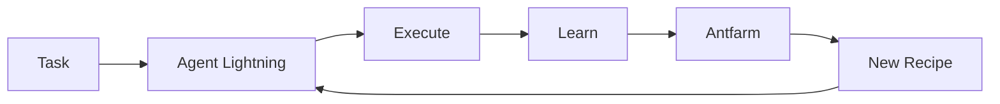

# Antfarm - Claude Code Skills Pack

Antfarm is a codified knowledge base of successful patterns, recipes, and workflows. It provides ready-to-use templates for common AI development tasks.

## Philosophy

Like ants building complex structures through simple repeated patterns, Antfarm provides:
- **Recipes**: Step-by-step patterns for common tasks
- **Templates**: Ready-to-use code scaffolds
- **Workflows**: End-to-end process definitions
- **Integrations**: Pre-built connections to tools and services

## Core Skill Categories

### 1. Project Scaffolding
- `scaffold-next-app` - Next.js 14 with App Router
- `scaffold-api-service` - Express/Fastify/Hono API
- `scaffold-mobile-app` - React Native / Expo
- `scaffold-telegram-bot` - Node.js Telegram bot

### 2. AI Integration
- `integrate-openai` - OpenAI API with streaming
- `integrate-anthropic` - Claude API with tools
- `integrate-local-llm` - Ollama/LM Studio setup
- `integrate-embeddings` - Vector embeddings pipeline

### 3. Database & Storage
- `setup-postgres` - PostgreSQL with migrations
- `setup-mongodb` - MongoDB with ODM
- `setup-redis` - Redis caching layer
- `setup-vector-db` - Pinecone/Weaviate/Milvus

### 4. Authentication
- `auth-jwt` - JWT-based authentication
- `auth-oauth` - OAuth 2.0 flow
- `auth-clerk` - Clerk integration
- `auth-supabase` - Supabase auth

### 5. Payments
- `payments-stripe` - Stripe checkout & webhooks
- `payments-lemonsqueezy` - Lemon Squeezy integration
- `subscriptions` - Recurring billing setup

### 6. Deployment
- `deploy-vercel` - Vercel deployment
- `deploy-fly` - Fly.io deployment
- `deploy-railway` - Railway deployment
- `deploy-docker` - Docker containerization

## Usage

```bash
# List available recipes
bun /home/workspace/Skills/antfarm/scripts/recipe.ts list

# Apply a recipe
bun /home/workspace/Skills/antfarm/scripts/recipe.ts apply <recipe-name> --target ./my-project

# Get recipe details
bun /home/workspace/Skills/antfarm/scripts/recipe.ts info <recipe-name>
```

## Integration with Agent Lightning

Antfarm receives successful patterns from Agent Lightning:
- High-reward actions → New recipes
- Repeated successful workflows → Templates
- Optimized processes → Workflow definitions



## Symbiotic WorkFrame

**Agent Lightning** ← Learning Loop
**Antfarm** ← Knowledge Base
**Together** → Self-Improving AI Workforce

```
┌─────────────────────────────────────────────┐
│           SYMBIOTIC WORKFRAME               │
├─────────────────────────────────────────────┤
│                                             │
│   ┌──────────────┐      ┌──────────────┐   │
│   │   AGENT      │      │   ANTFARM    │   │
│   │   LIGHTNING  │◄────►│   RECIPES    │   │
│   │              │      │              │   │
│   │  • Observe   │      │  • Patterns  │   │
│   │  • Act       │      │  • Templates │   │
│   │  • Reward    │      │  • Workflows │   │
│   │  • Learn     │      │  • Skills    │   │
│   └──────────────┘      └──────────────┘   │
│          │                     │           │
│          └──────────┬──────────┘           │
│                     │                      │
│              ┌──────▼──────┐               │
│              │   CLAUDE    │               │
│              │   CODE      │               │
│              │             │               │
│              │  Autonomous │               │
│              │  Execution  │               │
│              └─────────────┘               │
│                                             │
└─────────────────────────────────────────────┘
```

## Claude Code Integration

Antfarm is designed to work seamlessly with Claude Code:

1. **Context Injection**: Recipes inject context into Claude sessions
2. **Pattern Matching**: Claude can query Antfarm for relevant patterns
3. **Learning Capture**: Claude outcomes feed back to Agent Lightning
4. **Continuous Improvement**: Every task improves the knowledge base

## File Structure

```
antfarm/
├── SKILL.md              # This file
├── scripts/
│   ├── recipe.ts         # Recipe management CLI
│   ├── apply.ts          # Apply recipes to projects
│   └── sync.ts           # Sync with Agent Lightning
├── references/
│   ├── recipes/          # Recipe definitions
│   │   ├── scaffold-next-app.md
│   │   ├── integrate-openai.md
│   │   └── ...
│   ├── templates/        # Code templates
│   │   ├── api/
│   │   ├── frontend/
│   │   └── backend/
│   └── workflows/        # Workflow definitions
│       ├── deploy-pipeline.md
│       └── testing-protocol.md
└── assets/
    └── diagrams/         # Architecture diagrams
```

## Quick Start

1. Apply a recipe to start a new project:
   ```bash
   bun /home/workspace/Skills/antfarm/scripts/recipe.ts apply scaffold-next-app --target ./my-app
   ```

2. The recipe creates:
   - Project structure
   - Configuration files
   - Base components
   - Development setup

3. Agent Lightning learns from your modifications
4. Successful patterns become new recipes

## Contributing Recipes

Recipes are automatically created from high-reward Agent Lightning learnings. You can also manually create recipes in `references/recipes/`.

Recipe format:
```markdown
# Recipe: recipe-name

## Description
What this recipe creates

## Prerequisites
- Required tools
- Environment setup

## Steps
1. Step one
2. Step two
...

## Files Created
- file1.ts
- file2.ts

## Variables
- PROJECT_NAME
- API_KEY
```
